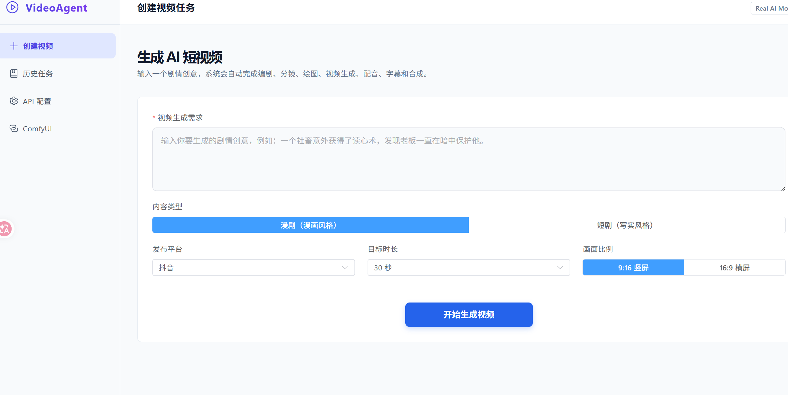
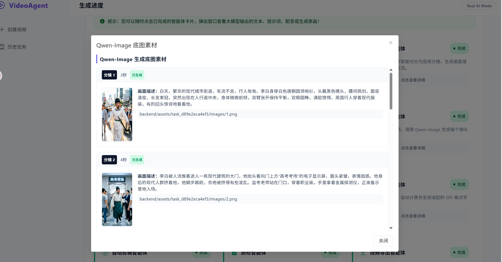
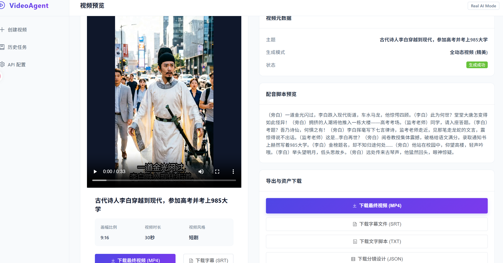
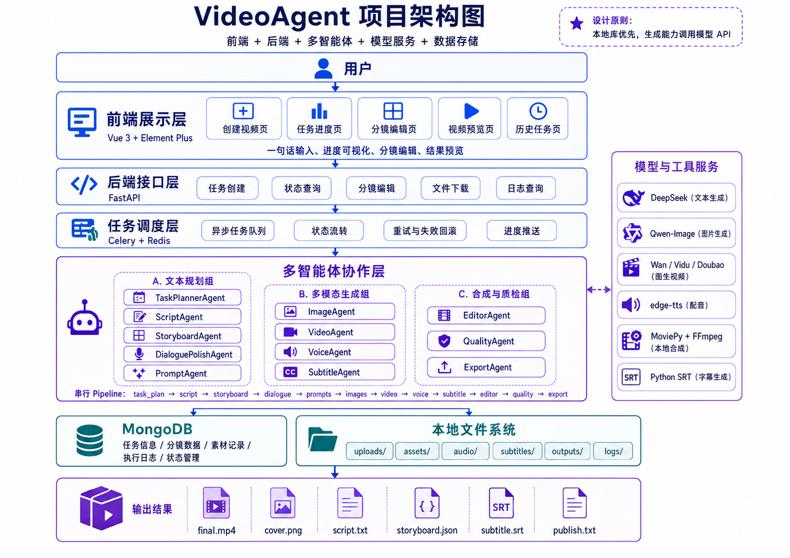
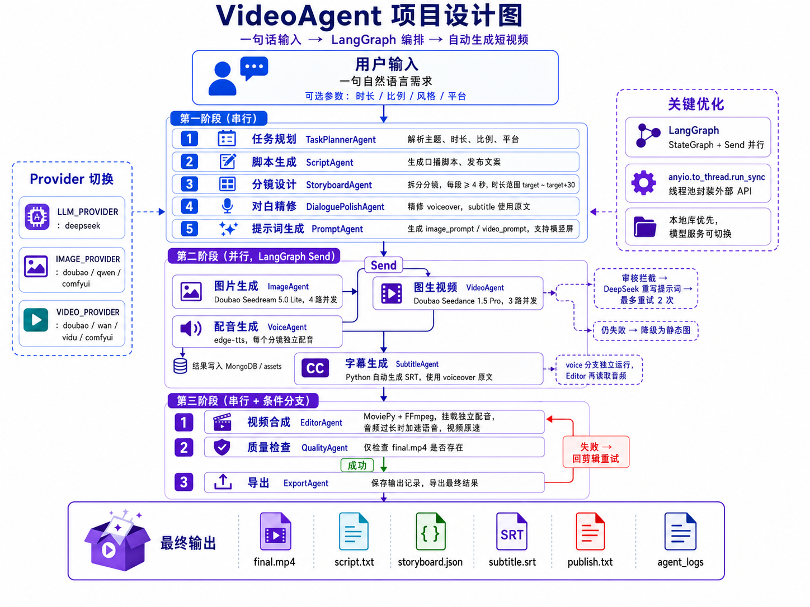

# VideoAgent — 基于多智能体协作的一键短视频生成系统

> **输入任意主题，AI 自动生成完整短视频。** 系统自动完成脚本、分镜、图片、视频、配音、字幕到最终合成，全程无需人工剪辑。

---

## 项目截图


*首页 — 创建视频任务，输入一句话即可开始生成*


*历史任务列表与实时生成进度追踪*


*生成完成后自动跳转预览页，可播放视频、下载 MP4 和字幕文件*


*系统总体架构：Vue 前端 → FastAPI 后端 → 多智能体协作 → MongoDB 存储 + 本地文件系统*


*12 个智能体在 LangGraph StateGraph 中编排执行（串行 + Send 并行分支 + 条件分支）*

---

## 系统架构

系统由 12 个智能体在 LangGraph StateGraph 中编排执行：

```
第一阶段（串行）：
TaskPlanner → Script → Storyboard → DialoguePolish → Prompt

第二阶段（并行，LangGraph Send）：
                ┌── Image → Video → Subtitle ──┐
Prompt ──Send()─┼──────────────────────────────┤
                └── Voice（独立运行，不触发后续）──┘

第三阶段（串行）：
Subtitle → Editor → Quality ──成功──→ Export → final.mp4
                          └──失败──→ Editor（重试）
```

### 智能体说明

> **使用 LangGraph 编排多智能体流程，LangChain 调用大模型。** 12 个 Agent 注册为 LangGraph StateGraph 节点，Send 并行分支 + 屏障汇聚 + 质检条件分支；LLM 统一通过 LangChain ChatOpenAI 调用 DeepSeek。

| 智能体 | 职责 | 调用服务 |
|--------|------|---------|
| TaskPlannerAgent | 解析用户需求，生成任务规划 | DeepSeek |
| ScriptAgent | 生成视频脚本和发布文案 | DeepSeek |
| StoryboardAgent | 拆分为连续分镜，每段≥4秒 | DeepSeek |
| DialoguePolishAgent | 精修对白和字幕文本 | DeepSeek |
| PromptAgent | 生成图片/视频提示词、运动节拍 | DeepSeek |
| ImageAgent | 生成底图（4路并发） | **Doubao Seedream** / Qwen / ComfyUI |
| VideoAgent | 图生视频（3路并发，审核AI重写重试） | **Doubao Seedance** / Wan / Vidu / ComfyUI |
| VoiceAgent | 每个分镜独立配音文件 | edge-tts |
| SubtitleAgent | 组装SRT字幕（使用voiceover原文） | 本地 |
| EditorAgent | 合成视频+字幕，配音超长时加速语音 | MoviePy + FFmpeg |
| QualityAgent | 检查final.mp4是否存在 | 文件检查 |
| ExportAgent | 保存结果到数据库 | — |

---

## 目录结构

```
video/
├── backend/
│   ├── agents/           # 12 个智能体
│   │   ├── pipeline.py   # LangGraph StateGraph 编排
│   │   ├── task_planner_agent.py
│   │   ├── script_agent.py
│   │   ├── storyboard_agent.py
│   │   ├── dialogue_polish_agent.py
│   │   ├── prompt_agent.py
│   │   ├── image_agent.py
│   │   ├── video_agent.py
│   │   ├── voice_agent.py
│   │   ├── subtitle_agent.py
│   │   ├── editor_agent.py
│   │   ├── quality_agent.py
│   │   └── export_agent.py
│   ├── core/
│   │   └── database.py   # MongoDB 连接
│   ├── models/           # Pydantic 数据模型
│   ├── routes/           # FastAPI 路由（含 API Key 设置接口）
│   ├── services/         # 外部服务封装
│   │   ├── llm/          # DeepSeek（LangChain ChatOpenAI）
│   │   ├── image/        # Doubao Seedream / Qwen-Image / ComfyUI
│   │   ├── video/        # Doubao Seedance / Wan / Vidu / ComfyUI
│   │   ├── comfyui/      # ComfyUI 客户端 + 配置
│   │   ├── provider_factory.py  # 模型路由工厂
│   │   ├── task_service.py
│   │   └── tts_service.py
│   ├── image/            # 项目截图与说明图片
│   ├── config.py         # 环境配置
│   └── main.py           # FastAPI 入口
├── frontend/             # Vue 3 + Element Plus 前端
├── VideoAgent_项目设计/  # 完整设计文档
│   ├── 01_项目总体设计.md
│   ├── 02_智能体与后端设计.md
│   ├── 03_前端页面与UI设计.md
│   ├── 04_ComfyUI本地多模态接入需求方案.md
│   └── 项目整体设计方案.md
├── .env.example          # 环境变量模板
├── .gitignore
└── README.md
```

---

## 快速开始

### 环境要求

- Python 3.13+
- MongoDB（本地运行）
- Node.js 18+（前端开发）
- FFmpeg（视频合成）

### MongoDB 安装

**Windows：**

1. 前往 [MongoDB Community Server 下载页](https://www.mongodb.com/try/download/community) 下载 MSI 安装包
2. 安装时选择 **Complete** 安装，勾选 "Install MongoDB as a Service"
3. 一路下一步完成安装，MongoDB 会自动作为 Windows 服务启动
4. 验证安装：
   ```bash
   # 在 PowerShell 中运行
   mongosh --eval "db.version()"
   # 输出版本号即表示安装成功
   ```

**macOS：**

```bash
brew tap mongodb/brew
brew install mongodb-community
brew services start mongodb-community
```

**Linux（Ubuntu / Debian）：**

```bash
# 导入 MongoDB GPG 密钥
curl -fsSL https://www.mongodb.org/static/pgp/server-7.0.asc | sudo gpg --dearmor -o /usr/share/keyrings/mongodb-server-7.0.gpg
# 添加源
echo "deb [ signed-by=/usr/share/keyrings/mongodb-server-7.0.gpg ] https://repo.mongodb.org/apt/ubuntu jammy/mongodb-org/7.0 multiverse" | sudo tee /etc/apt/sources.list.d/mongodb-org-7.0.list
# 安装
sudo apt update
sudo apt install -y mongodb-org
sudo systemctl start mongod
```

### 验证 MongoDB

安装并启动 MongoDB 后，验证数据库正常运行：

```bash
# 连接测试
mongosh --eval "db.version()"
# 应输出：7.0.x

# 检查服务状态（Windows PowerShell）
Get-Service MongoDB

# 检查服务状态（Linux）
sudo systemctl status mongod
```

项目默认连接 `mongodb://localhost:27017`，数据库名 `video_agent`。
如需修改，编辑 `.env` 文件中的 `MONGODB_URI` 和 `MONGODB_DB_NAME`。

启动后端后，访问 [http://localhost:8000/health](http://localhost:8000/health) 可查看 MongoDB 连接状态：

```json
{
  "status": "ok",
  "database": {
    "configured": true,
    "name": "video_agent"
  }
}

### 快速启动

```bash
# 1. 后端
cd backend
pip install -r requirements.txt
cp .env.example .env
# 在 .env 中填入 API Key，或在启动后通过前端页面配置
python -m uvicorn main:app --host 0.0.0.0 --port 8000

# 2. 前端（新开终端）
cd frontend
npm install
npm run dev

# 3. 打开浏览器访问 http://localhost:5173
```

### 生成视频

以 **"李白考上九八五"** 为例：

```bash
# 1. 创建任务
curl -X POST http://localhost:8000/api/video/create \
  -H "Content-Type: application/json" \
  -d '{"user_input": "李白考上九八五", "duration": 30}'

# 返回示例（记录 task_id）：
# {"status":"success","data":{"task_id":"task_xxx...","status":"created","progress":0}}

# 2. 启动 pipeline（把 {task_id} 换成上一步返回的 task_id）
curl -X POST http://localhost:8000/api/video/task_xxx/run-pipeline

# 3. 查看进度
curl http://localhost:8000/api/video/task_xxx/progress

# 4. 生成完成后获取结果
curl http://localhost:8000/api/video/task_xxx
# 返回中 status 为 "success" 表示完成
# video_path 即为最终视频路径
```

**通过前端页面：**

1. 访问首页，在输入框填写 `李白考上九八五`
2. 可选参数：时长 30 秒、风格 短剧、平台 抖音
3. 点击「创建任务」→ 自动跳转到进度页
4. 等待各智能体依次执行（约 5-10 分钟）
5. 完成后自动跳转预览页，可下载视频和字幕

---

## 环境变量

| 变量 | 说明 | 必填 |
|------|------|------|
| `DEEPSEEK_API_KEY` | DeepSeek API 密钥（脚本/分镜/提示词） | 是 |
| `VOLCENGINE_API_KEY` | 火山引擎方舟 API Key（豆包模型） | 使用 Doubao 时必填 |
| `DASHSCOPE_API_KEY` | 阿里通义 DashScope（Qwen/Wan） | 使用 Qwen/Wan 时必填 |
| `MONGODB_URI` | MongoDB 连接地址 | 否（默认 `localhost:27017`） |
| `ENABLE_PAID_API` | 是否启用付费 API | 开发建议 `false` |

### 模型选择

通过 `IMAGE_PROVIDER` 和 `VIDEO_PROVIDER` 切换：

```bash
# .env
IMAGE_PROVIDER=doubao     # doubao / qwen / comfyui
VIDEO_PROVIDER=doubao     # doubao / wan / vidu / comfyui
```

火山引擎方舟配置步骤：
1. 在[火山引擎方舟控制台](https://console.volcengine.com/ark)开通模型
2. 为 API Key 勾选对应模型的访问权限
3. 在 `.env` 中填入 `VOLCENGINE_API_KEY`
4. 模型 ID 使用带日期后缀的完整 ID（如 `doubao-seedream-5-0-lite-260128`）

---

## 设计文档

详见 [VideoAgent_项目设计/](./VideoAgent_项目设计/) 目录：

- [01_项目总体设计.md](./VideoAgent_项目设计/01_项目总体设计.md) — 总体架构、技术栈
- [02_智能体与后端设计.md](./VideoAgent_项目设计/02_智能体与后端设计.md) — 各智能体详细设计
- [03_前端页面与UI设计.md](./VideoAgent_项目设计/03_前端页面与UI设计.md) — 前端界面设计
- [项目整体设计方案.md](./VideoAgent_项目设计/项目整体设计方案.md) — 完整设计方案

---

## 许可证

MIT

---

## 使用守则

> ⚠️ **当前状态：提示词质量仍待优化。** 生成的图片和视频效果受提示词影响较大，部分场景可能出现画风不一致、动作不自然等情况，后续会持续改进 PromptAgent 的生成质量。

本系统旨在辅助合法、合规的短视频内容创作。使用本系统时，请遵守以下规则：

### 允许的用途

- 知识科普、教育类视频创作
- 合法的商业内容营销
- 个人创作者内容制作
- 学术研究与教学演示
- 新闻与媒体内容生产

### 禁止的用途

- 生成虚假信息、谣言或恶意误导内容
- 制作诽谤、侮辱、歧视或煽动仇恨的内容
- 生成或传播色情、暴力、赌博等违法内容
- 仿冒他人身份、制作 deepfake 诈骗视频
- 制作政治敏感或违反中国法律法规的内容
- 利用系统进行任何形式的欺诈、钓鱼或社会工程攻击
- 规避或破坏第三方平台内容审核机制

### 责任声明

本系统仅提供技术工具。使用者应自行对生成内容承担全部法律责任。
项目开发者不对使用者利用本系统制作的任何内容负责。
如发现系统被用于违法违规目的，项目方有权停止服务并保留追究权利。
